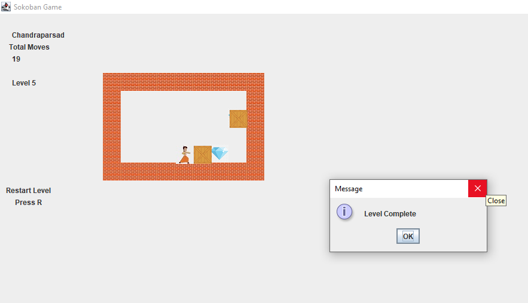

# Sokoban Game in Java

Welcome to the Sokoban Game repository! This project is an implementation of the classic Sokoban puzzle game using Java. Sokoban is a popular puzzle game where the player pushes boxes around a maze to their designated storage locations.

## Features

- **Classic Gameplay**: Enjoy the traditional Sokoban puzzle-solving experience.
- **Multiple Levels**: Play through various challenging levels with increasing difficulty.
- **Custom Levels**: Create and play your own custom levels.
- **Intuitive Controls**: Use keyboard controls to navigate through the game.

## Screenshots




## Installation

To run the game locally, follow these steps:

1. **Clone the repository**:
    ```bash
    git clone https://github.com/chandraparsad3/Sokoban.git
    cd Sokoban
    ```

2. **Compile the source code**:
    ```bash
    javac -d bin src/com/chandraparsad3/sokoban/*.java
    ```

3. **Run the game**:
    ```bash
    java -cp bin com.chandraparsad3.sokoban.Main
    ```

## How to Play

- Use the arrow keys to move the player.
- Push all the boxes to their target locations.
- Restart the level by pressing `R`.

## Contributing

Contributions are welcome! If you have suggestions for improvements or new features, feel free to create an issue or submit a pull request.

## Acknowledgements

- Thanks to the open-source community for providing resources and inspiration.
- Special thanks to all contributors for their support and contributions.
